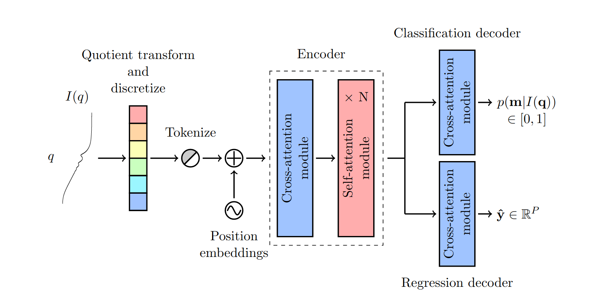

# Sasformer

<p align="center">
    
</p>

This repository contains the source code for the Sasformer model from Multi-task Scattering-Model Classification and Parameter Regression of Nanostructures from Small-Angle Scattering Data.

## SAS-55M-20k Dataset

Details on how to download the SAS-55M-20k dataset will be found here following publication of the manuscript of this work.

## Installation

After you have downloaded the SAS-55M-20k dataset, clone the repository and navigate to the `sasformer` parent directory.

```bash
git clone git@github.com:by256/sasformer.git
cd <path>/<to>/sasformer
```

Using [conda](https://conda.io/projects/conda/en/latest/user-guide/install/index.html), create and activate the virtual environment and install the package.

```bash
conda env create -f environment.yaml
conda activate sasformer
python -m pip install -e .
```

## Training

To train SASformer using the hyperparameters specified in the paper, update `data_dir` in `scripts/train_sasformer.sh` with the path of the SAS-55M-20k dataset and run the following script:

```bash
bash scripts/train_sasformer.sh
```

Note: we used a batch size of 1843 for training, but it is likely that you will have to adjust the `batch_size` parameter in this script to suit your hardware. Additionally, if you do not possess a graphics processing unit, change the `accelerator` parameter to `cpu`.

## Inference

To see an example of inference on I(q) generated using `sasmodels`, see the `sasformer/example.ipynb` notebook.

You can open this file by installing Jupyter Notebook, running it in the `sasformer/sasformer` directory and clicking on the `example.ipynb` file in the jupyter notebook file browser:

```bash
python -m pip install notebook
cd sasformer
jupyter notebook
# click on `example.py`.
```

## Results

To generate the test-set results presented in the paper, update `data_dir` in `scripts/results.sh` with the path of the SAS-55M-20k dataset and run the following script:

```bash
bash scripts/results.sh
```

You may have to adjust the `batch_size` and `accelerator` script parameters as mentioned in the [Training](#training) section.

## Citing

If you use the methods outlined in this repository, please cite the following work:

```
@article{Yildirim2024,
    author={Yildirim, Batuhan
    and Doutch, James
    and Cole, Jacqueline},
    title={Multi-Task Scattering-Model Classification and Parameter Regression of Nanostructures from Small-Angle Scattering Data},
    journal={Digital Discovery},
    year={2024},
    publisher={RSC},
    doi={10.1039/D3DD00225J},
    url={https://doi.org/10.1039/D3DD00225J}
}
```

## Funding

This project was financially supported by the [Science and Technology Facilities Council (STFC)](https://stfc.ukri.org/) and the [Royal Academy of Engineering](https://www.raeng.org.uk/) (RCSRF1819\7\10).

## Acknowledgement

This research used resources of the [Argonne Leadership Computing Facility](https://www.alcf.anl.gov/), which is a DOE Office of Science User Facility supported under Contract DE-AC02-06CH11357.

This work benefited from the use of the [SasView](https://www.sasview.org/) application, originally developed under NSF award DMR-0520547. SasView contains code developed with funding from the European Union’s Horizon 2020 research and innovation programme under the SINE2020 project, grant agreement No 654000.

## License

[](http://badges.mit-license.org)
